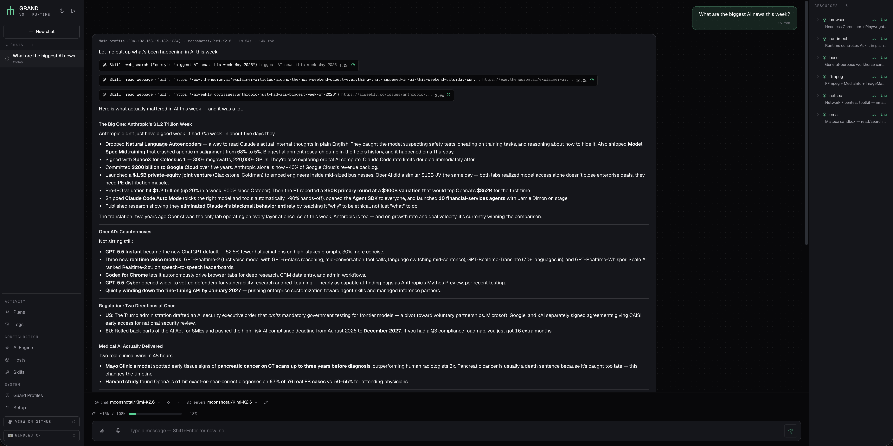

<h1>
  
  &nbsp;GRAND
</h1>

[](https://x0152.github.io/grand/)
[](LICENSE)
[](docs/)

> **One more AI-but-guarded system — supports Gonka inference, WinXP UI.**

Multi-agent runtime where an LLM orchestrates a pool of isolated agents, each running on a dedicated SSH sandbox container with specialized tools. Designed for managing large server infrastructure — from quick one-off tasks to complex multi-step workflows. You interact via Telegram or Web UI — the LLM routes tasks to the right agent, commands pass through a deterministic Guard before execution. Supports Gonka decentralised inference and any OpenAI-compatible engine.

> Early development — works end-to-end but expect rough edges.

## Quick start

```bash
git clone https://github.com/x0152/grand.git
cd grand
./quickstart.sh
```

When the script finishes it prints a URL and an `AUTH_TOKEN`. Open the URL, sign in with the token, then follow the in-app **setup wizard** (LLM, models, Telegram, email). More details further down.




## What it does

- **Chat** — write a message, the LLM picks which server to use and what commands to run
- **Guard** — every command goes through a security layer (profiles with capabilities + command whitelists) before execution
- **Any LLM** — works with any OpenAI-compatible API: cloud or local (Ollama, LM Studio, etc.)
- **Sandboxes** — each server is a Docker container with SSH and pre-installed tools
- **Skills** — reusable SSH scripts exposed as LLM tools with typed parameters and Go template injection
- **Plans** — agentic workflows: visual graph editor (React Flow) with action/decision nodes, branching, retries, clear context, cancel, scheduled execution via cron
  - **Parameters** — plans support typed input parameters (JSON Schema); node prompts use Go templates (`{{.param}}`) for dynamic values
  - **Agent-created plans** — the LLM agent can create multi-step plans from chat using a simple DSL (steps with actions and decisions), including scheduled tasks
- **Presets** — named model configurations (chat model, fallback model, image model) assignable per connection or globally
- **Memory** — long-term memory: remembers facts about you and each server across conversations
- **Notifications** — the agent can send proactive alerts and reports to Telegram via `send_notification`
- **Telegram** — bot with voice messages, files, model switching
- **ASR / OCR / TTS** — optional speech-to-text, OCR, text-to-speech integrations
- **Windows XP theme** *(experimental)* — opt-in retro desktop UI with draggable windows and taskbar; toggle from the sidebar, no functional difference

## Gonka

GRAND works with any OpenAI-compatible provider (OpenAI, Anthropic via gateway, Ollama, LM Studio, …), but the **first-class engine** is [Gonka](https://gonka.ai).

- **What it is.** A decentralised inference network — an open marketplace of independent GPU hosts serving any OpenAI-compatible model (Kimi K2.6 and other open-weight models). No central provider, no subscription; every request is settled on-chain from a `GNK` wallet.
- **What it costs.** **Under $0.01 per 1M tokens** on open models. Pay-per-request, no credit card.
- **What you need.** A wallet with a small `GNK` balance (the wizard requires ~0.1 GNK to start). The **setup wizard** can create a fresh wallet for you (mnemonic shown once), import an existing one, show the on-chain balance, and points the agent at a Gonka node by default (`https://node4.gonka.ai`).
- **Why it matters here.** Agent runs issue many cheap, parallel tool calls — one per sandbox, plan step, skill, retry. Centralised-provider bills scale super-linearly with that pattern; sub-cent inference makes "let the agent retry, branch, and self-correct" practical instead of expensive.

## Architecture

```
                                                ┌──────────────────┐
┌───────────┐  ┌───────────┐                    │  LLM provider    │
│ Telegram  │  │ Web Chat  │                    │  (OpenAI / local)│
└─────┬─────┘  └─────┬─────┘                    └────────┬─────────┘
      │               │                                  │ API
      ▼               ▼                                  │
┌────────────────────────────────────────────────────────┼────────┐
│  GRAND                           docker-compose / k8s  │        │
│                                                        │        │
│  ┌─────────────┐   ┌──────────────────┐          ┌─────┴──────┐ │
│  │  Web Panel  │   │   Agent Loop     │◀────────▶│ LLM client │ │
│  │   (React)   │   │                  │          └────────────┘ │
│  └─────────────┘   └────────┬─────────┘                         │
│                          tool calls                             │
│  ┌────────────┐         ┌───┴────┐                              │
│  │ PostgreSQL │         │ Guard  │──── deny ───▶ x blocked      │
│  └────────────┘         └───┬────┘                              │
│                           allow                                 │
│                    ┌────────┼────────┐                           │
│                    ▼        ▼        ▼                           │
│               ┌────────┬────────┬────────┬────────┐             │
│               │ agent  │ agent  │ agent  │ agent  │  ...        │
│               └───┬────┘───┬────┘───┬────┘───┬────┘             │
└───────────────────┼────────┼────────┼────────┼──────────────────┘
                    │        │        │        │ SSH
                    ▼        ▼        ▼        ▼
              ┌────────┐ ┌────────┐ ┌────────┐ ┌────────┐ ┌────────┐
              │  base  │ │browser │ │ ffmpeg │ │ python │ │   db   │
              │  :2222 │ │ :2223  │ │ :2224  │ │ :2225  │ │  :2226 │
              └────────┘ └────────┘ └────────┘ └────────┘ └────────┘
                    isolated SSH sandboxes with pre-installed tools
```

## Web Panel

| Page | Description |
|------|-------------|
| Chat | Conversations with the agent, session management |
| Plans | Visual workflow editor (React Flow), run history, parameters, scheduled execution |
| Skills | Reusable SSH scripts with parameter editor, exposed as agent tools |
| Hosts | SSH connection / sandbox management |
| AI Engine | LLM providers, models, and presets (chat / fallback / image) |
| Guard Profiles | Security profiles with capability and command whitelists |
| Setup | Re-run the setup wizard or reset configuration |
| Logs | Session logs with tool call details |

## Setup details

First boot ~10–15 min (prebuilds 7 sandbox images — depends on link speed and CPU), reboots <30 s. `quickstart.sh` generates `AUTH_TOKEN` / `RUNTIME_API_TOKEN`, builds and prebuilds everything, brings the stack up, and prints the URL + login token at the end. The **setup wizard** that opens on first sign-in handles the rest (LLM provider, models, Telegram, email/SMTP) — no `.env` editing required.

> **Skip wizard clicks:** pre-fill `.env` before running the script. Anything under `MANTIS_LLM_*` / `MANTIS_TG_*` / `MANTIS_EMAIL_*` is used as the wizard prefill on first run (and again after a Reset). See [`.env.example`](.env.example) for the full set; the wizard still lets you edit every field.

The same wizard lives under **Setup** in the sidebar: **Continue** resumes from the first unfinished step, **Re-run** walks every step with current values prefilled, **Reset** clears `app_config` and reopens the wizard (existing AI engine, hosts and channels stay editable on their pages).

```bash
docker compose logs -f app              # backend
docker compose logs -f sandbox-prebuild # sandbox build progress
docker compose down                     # stop
```

For a Kubernetes / Helm install, see [`helm/mantis/README.md`](helm/mantis/README.md).

## Known limitations

- **Docker is mandatory.** The sandbox runtime needs to spawn containers, so the host must run Docker (Linux / macOS / WSL2). Native Windows is not supported.
- **Kubernetes needs DinD or host-socket.** The backend talks directly to a Docker daemon to manage sandbox containers; there is no Kubernetes-native runtime yet. The Helm chart ships a **Docker-in-Docker sidecar** by default — that means an extra ~400 MB image per replica, slower pod start, and the sidecar pod is privileged. The alternative is mounting `/var/run/docker.sock` from the host, which is faster but ties pods to a specific node and weakens isolation. There is no rootless / Kata / gVisor path yet.
- **First boot is heavy.** ~10–15 min to pull base layers and build 7 sandbox images (highly dependent on link speed and CPU). The prebuild service caches by Dockerfile hash, so reboots and upgrades are <30 s.
- **Single-user by default.** `AUTH_TOKEN` is one-tenant; multi-user / SSO / RBAC is not implemented. Anyone with the token has the full agent surface.
- **Agent reliability scales with the model.** Small / older models hallucinate tool results, ignore sandbox boundaries, or fail to follow plan steps. Tested mostly with GPT-4-class and Kimi K2.6; expect rough behaviour on 7–13B local models.

## Generation limits

Per-message timeouts and tool-call iteration caps. Defaults are `15m` / `30` for the main agent (`MANTIS_SUPERVISOR_TIMEOUT` / `_MAX_ITERATIONS`), each SSH sub-agent (`MANTIS_SERVER_*`), and a single plan node (`MANTIS_PLAN_STEP_TIMEOUT`). Values take Go durations (`30s`, `15m`, `1h`). When a limit fires, the message is marked `cancelled` with a human-readable marker naming the env var to raise; partial text and completed tool steps are preserved.

## Dev

```bash
./dev.sh
```

Hot reload everywhere — `air` for Go, Vite HMR for the frontend. Frontend on `:27173`, backend on `:27480`, Postgres on `:5432`.

## Prod (single host)

```bash
./prod.sh
```

Multi-stage builds, frontend served by nginx, single port `:${MANTIS_PORT:-8080}` exposed, `restart: unless-stopped`.

## ASR, OCR & TTS (optional)

Plug in via `ASR_API_URL` / `OCR_API_URL` / `TTS_API_URL` in `.env`. ASR is OpenAI Whisper-compatible, so any Whisper endpoint (cloud, `whisper.cpp`, [russian-asr](https://github.com/x0152/russian-asr)) works. OCR pairs with [easy-ocr-api](https://github.com/x0152/easy-ocr-api), TTS with [cosyvoice-tts-api](https://github.com/x0152/cosyvoice-tts-api).

## License

MIT
